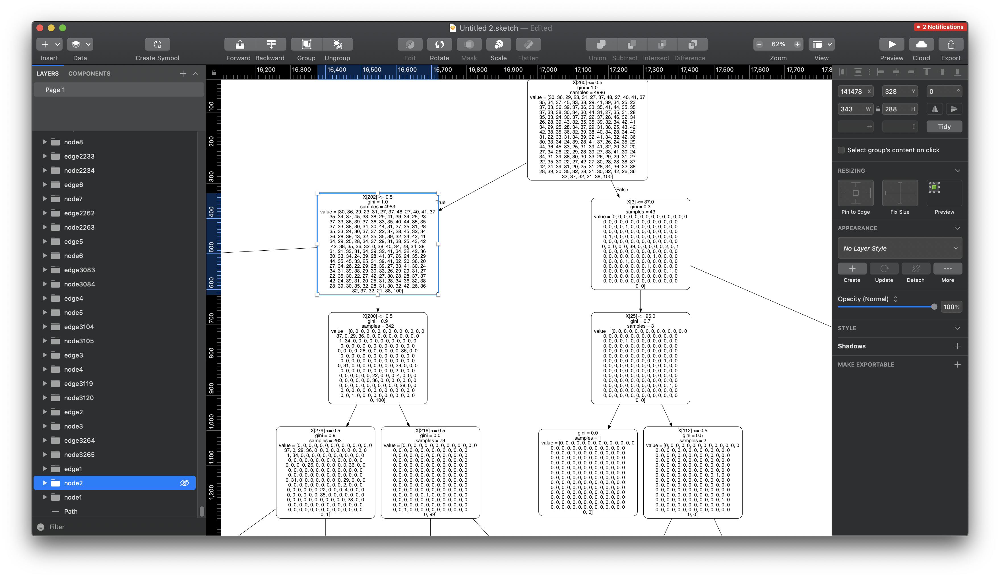

# h2classifier

This is a case study of the paper [Passive Monitoring of HTTPS Service Use
](https://hal.inria.fr/hal-01943936). The idea was to reimplement the random forest prediction algorithm in APL and see the performance gains.

## Methodology

1. The debugger with pyCharm was used to introspect the `scikit` and `numpy` models, from which `numpy.savetxt` function was used to extract model files to a `.csv` file
2. Using Sourcegraph, the `scikit` random forest implementation[[1](https://sourcegraph.com/github.com/scikit-learn/scikit-learn@9358a6ee8f93511fd615d3264fa7ee9de0f21b93/-/blob/sklearn/ensemble/_forest.py#L673), [2](https://sourcegraph.com/github.com/scikit-learn/scikit-learn@9358a6ee8f93511fd615d3264fa7ee9de0f21b93/-/blob/sklearn/tree/_classes.py#L916)] was refactored using the pyCharm debugger to produce APL program which produced the same result

Remarks:

The APL program is model specific. There are no guarantees the same program works across all RF models. Yet, for this case-study, handling only the model in which `output` is of the length of `1` is okay.

The first call to prediction is in the `h2classifier` `rf_tools.py` file. It looks like this:

```python
pred_lab = clf.predict(feat_)
```

Were `clf` is our model, and `feat_` are the samples. This call forwards to a function like this in:

```python
def predict(self, X):
    proba = self.predict_proba(X)

    if self.n_outputs_ == 1:
        return self.classes_.take(np.argmax(proba, axis=1), axis=0)

    else:
        n_samples = proba[0].shape[0]
        # all dtypes should be the same, so just take the first
        class_type = self.classes_[0].dtype
        predictions = np.empty((n_samples, self.n_outputs_),
                                dtype=class_type)

        for k in range(self.n_outputs_):
            predictions[:, k] = self.classes_[k].take(np.argmax(proba[k], axis=1), axis=0)

        return predictions
```

As our output size is 1, we only have to consider the first if-clause. But before that, the `self.predict_proba(X)` calls the following:

```python
def predict_proba(self, X):
    check_is_fitted(self)
    # Check data
    X = self._validate_X_predict(X)

    # Assign chunk of trees to jobs
    n_jobs, _, _ = _partition_estimators(self.n_estimators, self.n_jobs)

    # avoid storing the output of every estimator by summing them here
    all_proba = [np.zeros((X.shape[0], j), dtype=np.float64)
                    for j in np.atleast_1d(self.n_classes_)]
    lock = threading.Lock()
    Parallel(n_jobs=n_jobs, verbose=self.verbose,
                **_joblib_parallel_args(require="sharedmem"))(
        delayed(_accumulate_prediction)(e.predict_proba, X, all_proba,
                                        lock)
        for e in self.estimators_)

    for proba in all_proba:
        proba /= len(self.estimators_)

    if len(all_proba) == 1:
        return all_proba[0]
    else:
        return all_proba
```

Here, we focus on the parallel code that Python evaluates, specifically this block:

```python
Parallel(n_jobs=n_jobs, verbose=self.verbose,
         **_joblib_parallel_args(require="sharedmem"))(
    delayed(_accumulate_prediction)(e.predict_proba, X, all_proba,
                                    lock)
    for e in self.estimators_)
```

The way this call should be interpreted is the following: for each `e in self.estimators_`, caal the `_accumulate_prediction` function, to which a function parameter `e.predict_proba` among normal variables parameters `X`, `all_proba`, and `lock` are passed. This brings us to the `_accumulate_prediction` function, which looks like this:

```python
def _accumulate_prediction(predict, X, out, lock):
    prediction = predict(X, check_input=False)
    with lock:
        if len(out) == 1:
            out[0] += prediction
        else:
            for i in range(len(out)):
                out[i] += prediction[i]
```

Here, the `predict` is now the function parameter of `e.predict_proba`, which brings us to the next function:

```python
def predict_proba(self, X, check_input=True):
    check_is_fitted(self)
    X = self._validate_X_predict(X, check_input)
    proba = self.tree_.predict(X)

    if self.n_outputs_ == 1:
        proba = proba[:, :self.n_classes_]
        normalizer = proba.sum(axis=1)[:, np.newaxis]
        normalizer[normalizer == 0.0] = 1.0
        proba /= normalizer

        return proba

    else:
        all_proba = []

        for k in range(self.n_outputs_):
            proba_k = proba[:, k, :self.n_classes_[k]]
            normalizer = proba_k.sum(axis=1)[:, np.newaxis]
            normalizer[normalizer == 0.0] = 1.0
            proba_k /= normalizer
            all_proba.append(proba_k)

        return all_proba
```

Again, we have to only consider the if-clause in which the number of outputs is one, but before that, the function `self.tree_.predict` is called. This brings us to the next function:

```python
def predict(self, *args, **kwargs): # real signature unknown
    """ Predict target for X. """
    pass
```

Here, we see that the call-stack "disappears" but in fact, this means we are calling Cython, which is Python-like language which compiles into platform-specific bytecode. When we install performance-accelerated libraries like `scikit`, the fetch will compile the static libraries for us. To see the actual source code, we have to clone the un-compiled project. From here, we can see that the function which is called is the following:

```Cython
cpdef np.ndarray predict(self, object X):
    """Predict target for X."""
    out = self._get_value_ndarray().take(self.apply(X), axis=0,
                                         mode='clip')
    if self.n_outputs == 1:
        out = out.reshape(X.shape[0], self.max_n_classes)
    return out
```

As can be seen, the dialect is now a mix of C and Python. Here, `self._get_value_ndarray()` constructs a `numpy` presentation of the `tree_` object with which we called the code, which uses the `take()` method to do the actual random forest model prediction. The constructor looks like this:

```Cython
cdef np.ndarray _get_value_ndarray(self):
    """Wraps value as a 3-d NumPy array.
    The array keeps a reference to this Tree, which manages the underlying
    memory.
    """
    cdef np.npy_intp shape[3]
    shape[0] = <np.npy_intp> self.node_count
    shape[1] = <np.npy_intp> self.n_outputs
    shape[2] = <np.npy_intp> self.max_n_classes
    cdef np.ndarray arr
    arr = np.PyArray_SimpleNewFromData(3, shape, np.NPY_DOUBLE, self.value)
    Py_INCREF(self)
    arr.base = <PyObject*> self
    return arr
```

The `self.value` variable here comes from the following method:

```Cython
def __setstate__(self, d):
    """Setstate re-implementation, for unpickling."""
    self.max_depth = d["max_depth"]
    self.node_count = d["node_count"]

    if 'nodes' not in d:
        raise ValueError('You have loaded Tree version which '
                         'cannot be imported')

    node_ndarray = d['nodes']
    value_ndarray = d['values']

    value_shape = (node_ndarray.shape[0], self.n_outputs,
                   self.max_n_classes)
    if (node_ndarray.ndim != 1 or
            node_ndarray.dtype != NODE_DTYPE or
            not node_ndarray.flags.c_contiguous or
            value_ndarray.shape != value_shape or
            not value_ndarray.flags.c_contiguous or
            value_ndarray.dtype != np.float64):
        raise ValueError('Did not recognise loaded array layout')

    self.capacity = node_ndarray.shape[0]
    if self._resize_c(self.capacity) != 0:
        raise MemoryError("resizing tree to %d" % self.capacity)
    nodes = memcpy(self.nodes, (<np.ndarray> node_ndarray).data,
                   self.capacity * sizeof(Node))
    value = memcpy(self.value, (<np.ndarray> value_ndarray).data,
                   self.capacity * self.value_stride * sizeof(double))
```

Here, we can see that the `self.value` represents the data that resides within the `d["values"]` structure.

Next, we may focus on the `self.apply(X)` call of the initial `predict` function, which brings us to the following function:

```Cython
cpdef np.ndarray apply(self, object X):
    """Finds the terminal region (=leaf node) for each sample in X."""
    if issparse(X):
        return self._apply_sparse_csr(X)
    else:
        return self._apply_dense(X)
```

Our tree is always dense, so we look at the dense call, which brings us to this function:

```Cython
cdef inline np.ndarray _apply_dense(self, object X):
    """Finds the terminal region (=leaf node) for each sample in X."""

    # Check input
    if not isinstance(X, np.ndarray):
        raise ValueError("X should be in np.ndarray format, got %s"
                         % type(X))

    if X.dtype != DTYPE:
        raise ValueError("X.dtype should be np.float32, got %s" % X.dtype)

    # Extract input
    cdef const DTYPE_t[:, :] X_ndarray = X
    cdef SIZE_t n_samples = X.shape[0]

    # Initialize output
    cdef np.ndarray[SIZE_t] out = np.zeros((n_samples,), dtype=np.intp)
    cdef SIZE_t* out_ptr = <SIZE_t*> out.data

    # Initialize auxiliary data-structure
    cdef Node* node = NULL
    cdef SIZE_t i = 0

    with nogil:
        for i in range(n_samples):
            node = self.nodes
            # While node not a leaf
            while node.left_child != _TREE_LEAF:
                # ... and node.right_child != _TREE_LEAF:
                if X_ndarray[i, node.feature] <= node.threshold:
                    node = &self.nodes[node.left_child]
                else:
                    node = &self.nodes[node.right_child]

            out_ptr[i] = <SIZE_t>(node - self.nodes)  # node offset

    return out
```

This is now the bottom function of the call stack. We focus on the `with nogil:` part and everything that comes after it, as this is the parallel code we are looking for. Informally, what happens here is the following: first, the `nogil` notation is a pragma to the OpenMP acceleration library. Inside of the pragma, we find that we iterate each sample in our tree, and then make a binary selection on it. If the node in the sample is `_TREE_LEAF`, which is a constant of `-1`, then we save the previous node index into a Cython pointer structure. Once we return the function, we should have a collection of indices that the Cython `predict` function then uses to take values out of the initial tree model.

Here, it is worth noticing that the `node = self.nodes` points to a `Node` type. This is given earlier in the source code:

```Cython
NODE_DTYPE = np.dtype({
    'names': ['left_child', 'right_child', 'feature', 'threshold', 'impurity',
              'n_node_samples', 'weighted_n_node_samples'],
    'formats': [np.intp, np.intp, np.intp, np.float64, np.float64, np.intp,
                np.float64],
    'offsets': [
        <Py_ssize_t> &(<Node*> NULL).left_child,
        <Py_ssize_t> &(<Node*> NULL).right_child,
        <Py_ssize_t> &(<Node*> NULL).feature,
        <Py_ssize_t> &(<Node*> NULL).threshold,
        <Py_ssize_t> &(<Node*> NULL).impurity,
        <Py_ssize_t> &(<Node*> NULL).n_node_samples,
        <Py_ssize_t> &(<Node*> NULL).weighted_n_node_samples
    ]
})
```

This is an important remark because the `Node` structure is another layer of abstraction: it creates relations between different nodes and the tree's decision tree. This can be slightly misleading. For example, let us first consider an APL candidate to replace the decision tree traversal:

```apl
apply←{{
    i←⍵
    node←{⍵{(⍵+1)⌷,right[⍺;],left[⍺;]}i(⍵⌷feature)⌷x≤⍵⌷th}while{⍵⌷left≠¯1}1
    out[i;]←node 1⌷values
}⍵}
```

APL is read right to the left. To do the translation, we first assume that `node = self.nodes` refers to both the array's address and its contents, as typical in C. As such, we can assume the index of 1 to be the first parameter in the APL `node` definition. After this, the APL uses a `dfns` while construct. The loops conditional is:

```apl
⍵⌷left≠0
```

Here, we check whether the value of the left array at omega is ¯1, which corresponds to Python's `_TREE_LEAF` constant. Omega is the right-hand side parameter identifier in APL, which here amounts to one, per the reasoning in the previous paragraph. Next, if the conditional is true, then

```apl
⍵{(⍵+1)⌷,right[⍺;],left[⍺;]}i(⍵⌷feature)⌷x≤⍵⌷th
```

Here, the code has two blocks, of which

```apl
i(⍵⌷feature)⌷x≤⍵⌷th
```

Is executed first. Here, we take the variable `i`, which amounts to the for loop's index, as in the Cython code. We then use clauses to calculate the index at omega on the feature array. These two calls mean that we do a selection of row `i` and column `⍵⌷feature` of `x` array, which is the sample array. We then compare the result with the one at position omega on array `th` (threshold). The omega here is the index passed from the right-hand side, that is, it is the value `1`. Now, the call will print either 0 or 1, corresponding to False or True. This is then passed into the second part of the APL call:

```apl
⍵{(⍵+1)⌷,right[⍺;],left[⍺;]}
```

Here, we have first placed omega of the outer block (that is, the value of 1) as the alpha argument (left-hand side) to go inside the bracketed call. We do this because the binary value from the above call will get passed as the omega argument inside the bracketed call. The call itself makes a selection: it adds 1 to the binary value and uses this value to make a selection between the two arrays. This means it retrieves either the value at position alpha from the array `right` when the comparison call received False or alternatively the position alpha from the array `left` when the comparison was True. The resulting value will then be returned as the omega parameter back to the while condition. Once false, the while loop terminates, and the previous value will be saved in the call

```apl
out[i;]←node 1⌷values
```

Where the `i` is the loop iterator value, and the node is the last loop value from the while. As an example, assume that the binary selection is always True, and the `left` array is `(2 3 -1 4)`. Now, we would first pluck `2` from the array, and use the index to find the second value from the left array again, assuming that the binary selection always returns `1`. We would then get `3`, which gets looped again because it is not `-1`. On the third iteration, we would find `-1` after which we would return from the loop, and have the value `3` as the node value. In a usual case, we would bounce between the `right` and `left` arrays until we would find `-1`.

The returned value is then used to take values from `values` array using an index operator. As such, this part already corresponds to the Cython part where the `take()` method is applied.

```Cython
cpdef np.ndarray predict(self, object X):
    """Predict target for X."""
    out = self._get_value_ndarray().take(self.apply(X), axis=0,
                                         mode='clip')
    if self.n_outputs == 1:
        out = out.reshape(X.shape[0], self.max_n_classes)
    return out
```

Unfortunately, this piece of code is slightly incorrect. This can be troubleshot by inspecting the `Node` construct of Python. In fact, the concept of a `Node` is not simply an array value; it is another value that comes from the predictor construct. Additionally, as it is a Cython object, is hidden from the Python debugger. However, it can be retrieved if exported into a visualized form:

```python
from sklearn.tree import export_graphviz
import pydot

export_graphviz(m.estimators_[0], out_file = 'tree.dot', rounded = True, precision = 1)
```

This prints us a file, which is the actual `Node` values, which we have to use for determining traversal when using our algorithm. We can inspect it by turning the `.dot` file into SVG file:

```bash
dot -Tpdf tree.dot > map.pdf
```

This produces a PDF file which we can zoom in to see the decision tree structure:



From here, we can understand that the tree indexing is off by one: on the left side, we can see that we are looking at node 2, but this corresponds in the Python dataset as 1. This is fixed on the APL level by following:

```apl
feature ← feature+1
right ← right+1
left ← left+1
```

Additionally, while invariant has to be changed to the following:

```apl
⍵⌷left≠0
```

To compensate for the fact that the undefined index is no 0. This is also nice in the sense that the left and right arrays can now be encoded as unsigned integers.

As such, the Cython level code is refactored to the following APL function:

```apl
apply←{{
    i←⍵
    node←{⍵{(⍵+1)⌷,right[⍺;],left[⍺;]}i(⍵⌷feature)⌷x≤⍵⌷th}while{⍵⌷left≠0}1
    out[i;]←node 1⌷values
}⍵}
```

Next, we move up in the callstack back to the Python functions. The APL equivalent of everything is:

```apl
{1⌷[2]↑⍒¨↓⍵(÷⍤1 0){⍵+0÷⍵}+/⍵
```

What we have here is a sum reduction (`+/⍵`) applied to a normalization (`⍵(÷⍤1 0){⍵+0÷⍵}`), after which for each matrix column a descending indice sort is applied (`⍒¨↓`), and the indices of each columns are returned (`1⌷[2]↑`).

In general, it could be said that in Python, much effort goes into dealing with asynchronous and parallel code, which requires multiple methods, source files, and libraries. In APL, these performance improving methodologies are implicit, and the math function of the RF prediction is arguably more succintly described.
